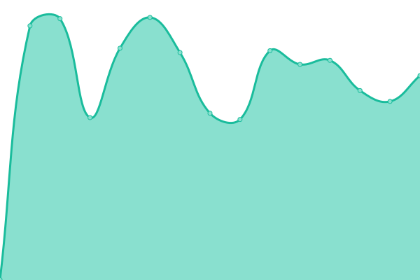
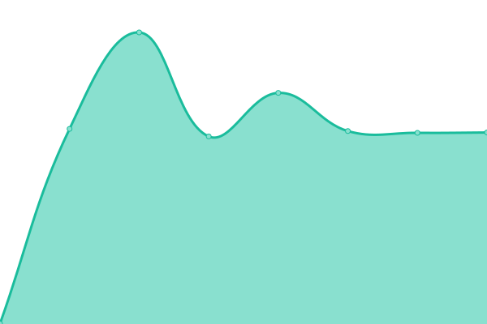
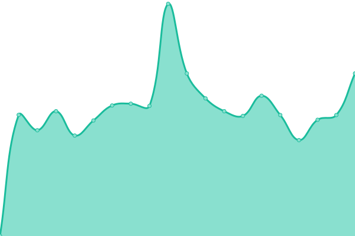

# [📈 Live Status](https://boyercam.github.io/boyercam-upptime): <!--live status--> **🟩 All systems operational**

This repository contains the open-source uptime monitor and status page for [Rachel Boyer](https://boyercam.github.io/boyercam-upptime), powered by [Upptime](https://github.com/upptime/upptime).

With [Upptime](https://upptime.js.org), you can get your own unlimited and free uptime monitor and status page, powered entirely by a GitHub repository. We use [Issues](https://github.com/boyercam/boyercam-upptime/issues) as incident reports, [Actions](https://github.com/boyercam/boyercam-upptime/actions) as uptime monitors, and [Pages](https://boyercam.github.io/boyercam-upptime) for the status page.

<!--start: status pages-->
<!-- This summary is generated by Upptime (https://github.com/upptime/upptime) -->
<!-- Do not edit this manually, your changes will be overwritten -->
<!-- prettier-ignore -->
| URL | Status | History | Response Time | Uptime |
| --- | ------ | ------- | ------------- | ------ |
|  [IRGUK Website](https://www.irguk.co.uk) | 🟩 Up | [irguk-website.yml](https://github.com/boyercam/boyercam-upptime/commits/HEAD/history/irguk-website.yml) | 

 307ms
     
 | 

<a href="https://boyercam.github.io/boyercam-upptime/history/irguk-website">90.67%</a>
    

|  [IRGUK Hydrogen](https://hydrogen.irguk.co.uk) | 🟩 Up | [irguk-hydrogen.yml](https://github.com/boyercam/boyercam-upptime/commits/HEAD/history/irguk-hydrogen.yml) | 

 518ms
     
 | 

<a href="https://boyercam.github.io/boyercam-upptime/history/irguk-hydrogen">100.00%</a>
    

|  [Rachel Owens Website](https://www.rachelowens.co.uk) | 🟩 Up | [rachel-owens-website.yml](https://github.com/boyercam/boyercam-upptime/commits/HEAD/history/rachel-owens-website.yml) | 

 813ms
     
 | 

<a href="https://boyercam.github.io/boyercam-upptime/history/rachel-owens-website">90.43%</a>
    

|  DDNS | 🟩 Up | [ddns.yml](https://github.com/boyercam/boyercam-upptime/commits/HEAD/history/ddns.yml) | 

 410ms
     
 | 

<a href="https://boyercam.github.io/boyercam-upptime/history/ddns">95.94%</a>
    

<!--end: status pages-->

[**Visit our status website →**](https://boyercam.github.io/boyercam-upptime)

## 📄 License

- Powered by: [Upptime](https://github.com/upptime/upptime)
- Code: [MIT](./LICENSE) © [Anand Chowdhary](https://anandchowdhary.com), supported by [Pabio](https://pabio.com)
- Data in the `./history` directory: [Open Database License](https://opendatacommons.org/licenses/odbl/1-0/)
